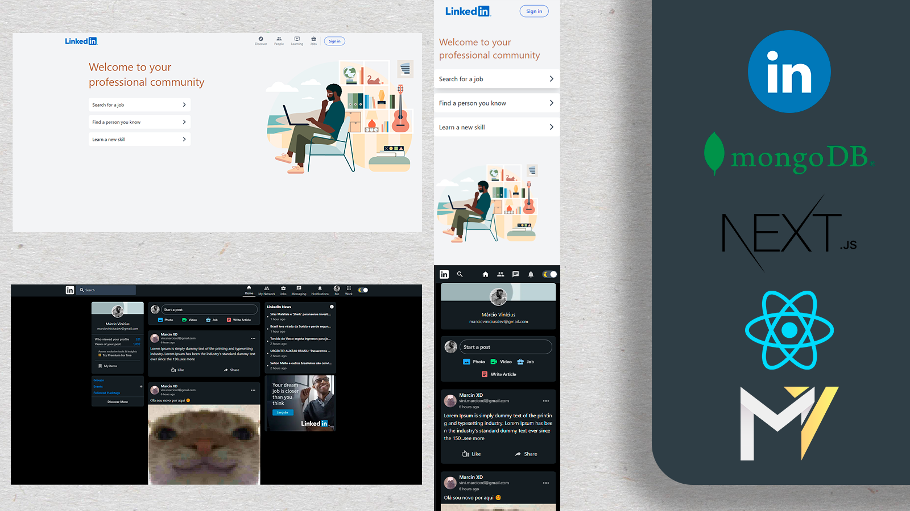
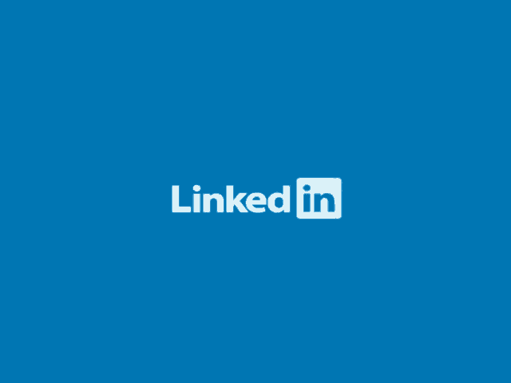
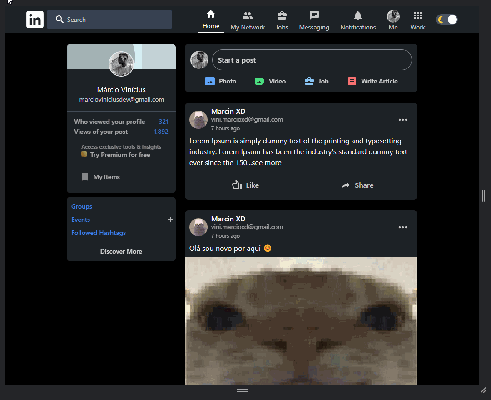

  <a style="color:#F806CC;font-weight:bold" href="#Projeto">Projeto</a>&nbsp;&nbsp;&nbsp;|&nbsp;&nbsp;&nbsp;
  <a style="color:#F806CC;font-weight:bold" href="#Desenvolvimento">Desenvolvimento</a>&nbsp;&nbsp;&nbsp;|&nbsp;&nbsp;&nbsp;
  <a style="color:#F806CC;font-weight:bold" href="#Features">Features</a>&nbsp;&nbsp;&nbsp;|&nbsp;&nbsp;&nbsp;
  <a style="color:#F806CC;font-weight:bold"
  href="#Extras">Extras</a>&nbsp;&nbsp;&nbsp;

</img>

#  ⚡**Projeto**

Aplicação web clone do Linkedin (plataforma de streaming) desenvolvida com **Next.js** para fins de aprendizado.
 

#  ⚙️**Desenvolvimento**

🔸Projeto desenvolvido com a metodologia Mobile-Frist portanto é totalmente responsivo.

🔸Alem do design, foram replicadas algumas funcionalidades Login e authenticaçao de usuário, criação e deleção de posts, alternancia de
temas dark e light.

🔸API utilizada para o conteúdo de notícias - <a href="https://newsapi.org/"><b>News API</b></a>

### **✨Linguagens**:

Typescript | HTML | CSS

### **✨Tecnologias**:

React(Next.js) | Tailwind CSS | MongoDB | Next API & Middlewares

### **✨Principais bibliotecas**:

RecoilJs | FramerMotion | NextAuth | Timeago-React | NextThemes | MaterialUI |

## **Testando o projeto**

➡️ Para testar a aplicação acesse o <a href="linkedin-clone-study.vercel.app">**_LINK_**</a>  
🔺Faça autenticação com uma conta Google clicando no botão **Login** 
🔺**Confira o conteúdo...**
 

# **🔥Features**:

#### **✅Sistema de login e atutenticação com NextAuth**

#### **✅Criação de posts e deleção de posts realizadas pelo usuário**

#### **✅Interface identica a aplicação original**

#### **✅Toggle Dark and White theme**

#### **✅Widget com notícias atualizadas frequentemente**

#### **✅Responsividade**

 

# **🎁Extras**

